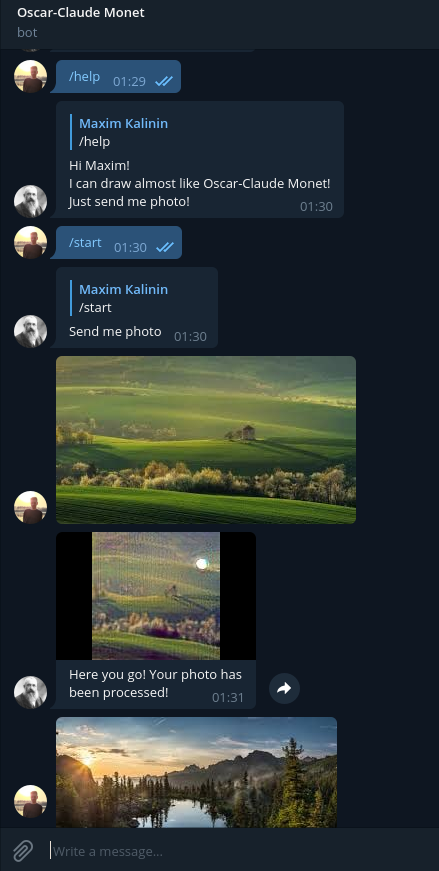
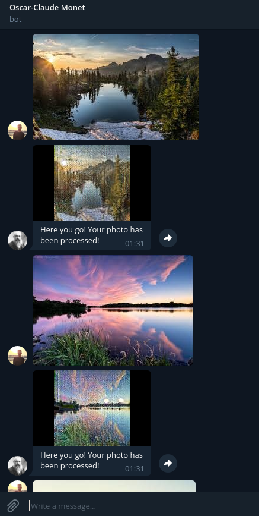
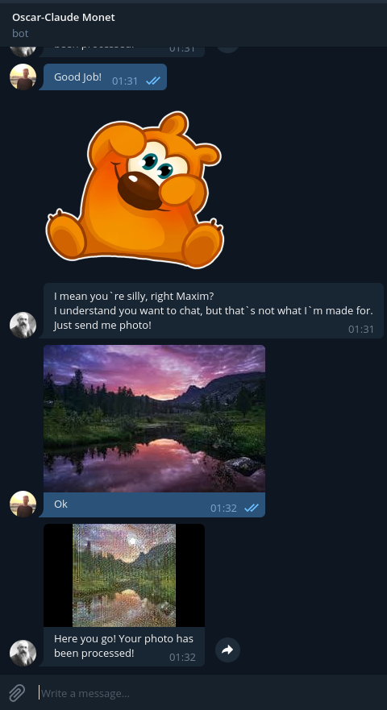

# CycleGAN

#### An implementation of CycleGan for learning an image-to-image translation without input-output pairs using Keras.

* Original paper: https://arxiv.org/abs/1703.10593

* You can check the architecture of our models here: [Generator](images/plot_model_generator.png), [Discriminator](images/discriminator_model_plot.png)


# Results

### 1. Monet -> Photo <br>
        

### 2. Photo -> Portrait <br>

+++++++++++++++++++++++++++++#TODO

### 3. Telegram Bot <br>
We deployed 2 telegram bots. You can send it a photo. It runs through the model, and in response, you will receive a processed photo.

You can find it +++++++++++++#TODO


  

++++++++++++++++++++++++++++++#TODO
## Requirement
```bash
$ pip install -r requirements.txt
```


## Data preparing
 * Download a dataset, e.g portrait2photo
 ```bash
 $ ./bin/datasets.sh portrait2photo
 ```
## Training

```bash
$ python3 train.py


Optoinal arguments:
 --img_rows                        default: 128,           image height
 --img_cols                        default: 128,           image width
 --input_nc                        default: 3,             input image channels
 --n_epochs                        default: 200,           help='number of training epochs
 --use_lr_decay                    default: True,          if True -> the model usus learning rate decay
 --decay_epoch                     default: 101,           epoch after wich start lr decay
 --dataset_name                    default: 'monet2photo', name of the dataset
 --batch_size                      default: 8,             size of the batch
 --lr                              default: 0.0002,        adam: learning rate
 --beta_1                          default: 0.5,           adam: beta_1
 --beta_2                          default: 0.999,         adam: beta_2
 --lambda_validation               default: 1.0,           are the images created by generator corresponding to the discriminator
 --lambda_reconstr                 default: 10.0,          if we use two generators one after the other (in both directions), will the original image work
 --lambda_id                       default: 5.0,           if we apply each generator to images from target area, will the image remain unchanged?
 --n_residual_blocks               default: 9,             number of residual blocks in generator
 --sample_interval t               default: 300,           interval to save models and val images
 --increase_generator_iteration    default: False,         increase the number of generator iterations in train loop
 --generator_iterations            default: 3,             number of generator iterations in train loop
```

## Pretrained model

* You can download pre-trained generator use:
```bash
./bin/load_model.sh
```
